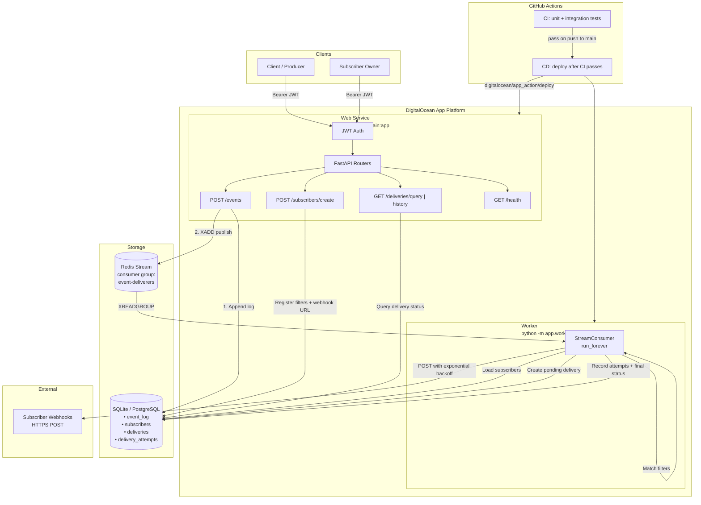
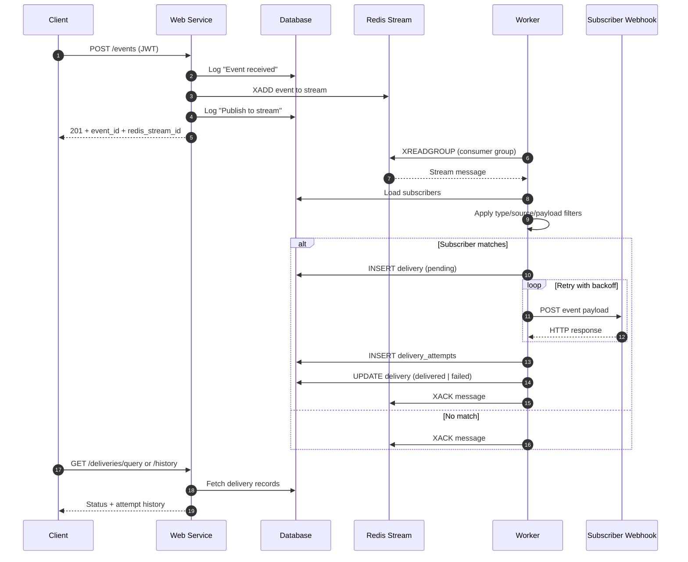
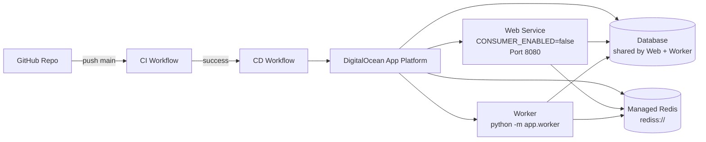

# Architecture

Event ingestion API with dual persistence (database + Redis streams), subscriber webhooks, and a standalone worker for async delivery.

## System overview

## Event delivery sequence

## Deployment layout

## Components

| Component | Role |
|-----------|------|
| **Web Service** | JWT-protected API: ingest events, manage subscribers, query deliveries |
| **Database** | Append-only event log, subscriber registry, delivery tracking |
| **Redis Stream** | Durable async buffer between ingestion and delivery |
| **Worker** | Consumes stream, filters subscribers, delivers webhooks with retries |
| **CI** | Unit tests + Redis integration tests on every push/PR |
| **CD** | Deploys to DigitalOcean only after CI passes on `main` |

## API surface

| Endpoint | Auth | Purpose |
|----------|------|---------|
| `POST /events` | JWT | Ingest event; persist to DB and publish to Redis |
| `POST /subscribers/create` | JWT | Register webhook URL and filter rules |
| `GET /subscribers/list` | JWT | List caller's subscribers |
| `DELETE /subscribers/{id}` | JWT | Delete caller's subscriber |
| `GET /deliveries/query` | JWT | Delivery status (no attempt history) |
| `GET /deliveries/history` | JWT | Delivery status with per-attempt log |
| `GET /health` | Public | Service health + Redis connectivity |

## Data model

| Table | Purpose |
|-------|---------|
| `event_log` | Append-only audit log (`Event received` → `Publish to stream`) |
| `subscribers` | Webhook URL, owner user ID, JSON filter rules |
| `deliveries` | Final delivery status: `pending`, `delivered`, `failed` |
| `delivery_attempts` | Per-attempt timestamp, HTTP status, failure reason |

## Ingestion flow

1. Client sends `POST /events` with JWT.
2. API writes `"Event received"` to `event_log`.
3. API publishes the event to the Redis stream via `XADD`.
4. API writes `"Publish to stream"` to `event_log` with `redis_stream_id`.
5. If Redis is unavailable after the DB write, API returns `503` with the persisted `event_id`.

## Delivery flow

1. Worker reads messages via `XREADGROUP` from consumer group `event-deliverers`.
2. For each subscriber, filter rules are evaluated (`type`, `source`, `payload_conditions`).
3. On match, a `pending` delivery row is created.
4. Webhook is POSTed with exponential backoff retries.
5. Each attempt is recorded in `delivery_attempts`.
6. Delivery is marked `delivered` or `failed`.
7. Message is acknowledged with `XACK`.

## Subscriber filters

Filters support:

- `type` — exact event type match
- `source` — exact source match
- `payload_conditions` — operators: `eq`, `neq`, `contains`, `exists`

## Process model

### Web Service

- Entry point: `uvicorn app.main:app --host 0.0.0.0 --port 8080`
- Set `CONSUMER_ENABLED=false` when running a separate worker
- Optionally starts an embedded consumer via FastAPI lifespan (single-process dev mode)

### Worker

- Entry point: `python -m app.worker`
- Runs `StreamConsumer.run_forever()` in the foreground
- Handles `SIGTERM` / `SIGINT` for graceful shutdown
- Uses the same `DATABASE_URL` and `REDIS_URL` as the web service

## CI/CD

### CI (`.github/workflows/ci.yml`)

| Job | Command | Dependencies |
|-----|---------|--------------|
| Unit tests | `pytest -m "not integration"` | None |
| Integration tests | `pytest -m integration` | Redis service container |

### CD (`.github/workflows/cd.yml`)

- Triggered by successful CI on push to `main`
- Deploys via `digitalocean/app_action/deploy@v2`
- Requires GitHub secrets: `DIGITALOCEAN_ACCESS_TOKEN`, `DO_APP_ID`

## Configuration

See `.env.example` for all environment variables. Required in production:

- `JWT_SECRET_KEY` — HS256 signing key (min 32 bytes recommended)
- `REDIS_URL` — Redis connection string (`rediss://` for DO Managed Redis)
- `DATABASE_URL` — SQLite for single-container; PostgreSQL when web and worker are split

## Production notes

- **Single container**: SQLite with a volume mounted at `/data` works for demos.
- **Split web + worker**: Use Managed PostgreSQL so both processes share the same database.
- **Scaling workers**: Use unique `REDIS_CONSUMER_NAME` per worker instance; they share the same consumer group for load balancing.
- **Redis access**: Add App Platform apps as trusted sources in DO Managed Redis settings.
